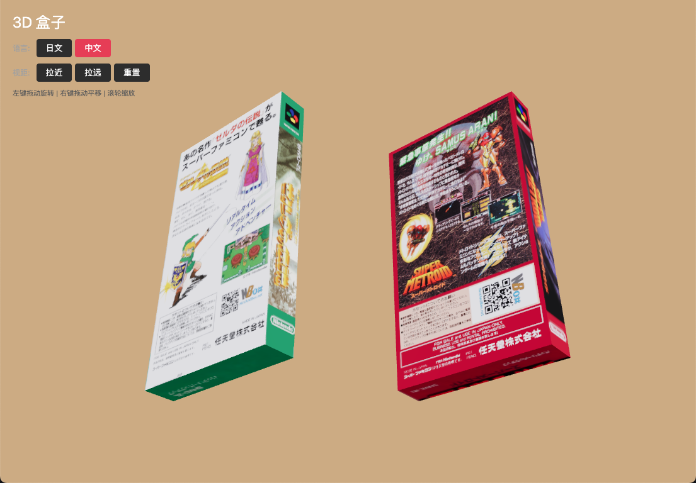

# 3D 盒子展示实验

> 这是一个实验性质的项目，目前没有下一步开发计划。

一个基于 React + Three.js 的 3D 盒子展示应用，用于学习和探索 React Three Fiber 技术。

## 演示截图




## 演示视频

演示视频已保存至 [docs/screenclip.mp4](docs/screenclip.mp4)，可在本地查看。

## 功能特性

- 3D 盒子展示（两个游戏盒子并排）
- 日文/中文封面一键切换
- 交互操作：
  - 左键拖动旋转盒子
  - 右键拖动平移视角
  - 滚轮缩放
  - 键盘上下键缩放
- UI 视距控制按钮（拉近/拉远/重置）
- 棕褐色背景 + 增强光照效果

## 技术栈

- **React 19** - UI 框架
- **TypeScript** - 类型安全
- **Vite 7** - 构建工具
- **Three.js** - 3D 渲染引擎
- **@react-three/fiber** - React Three.js 渲染器
- **@react-three/drei** - 实用工具库

## 运行项目

```bash
# 安装依赖
pnpm install

# 启动开发服务器
pnpm dev

# 构建生产版本
pnpm build

# 运行 ESLint 检查
pnpm lint

# 预览构建结果
pnpm preview
```

## 打包部署

### Windows

```bash
# 需要安装 Node.js 和 pnpm

# 1. 安装依赖
pnpm install

# 2. 构建
pnpm build

# 3. 打包（使用 electron-builder）
npx electron-builder --win --x64

# 输出文件在 dist/win-unpacked/ 目录
```

### macOS

```bash
# 需要 macOS 系统和 Xcode

# 1. 安装依赖
pnpm install

# 2. 构建
pnpm build

# 3. 打包
npx electron-builder --mac --x64

# 输出文件在 dist/mac/ 目录（.dmg 或 .zip）
```

**注意**: 本项目目前仅包含 Web 版本，打包相关配置需要额外添加 electron 集成。

## 项目结构

```
box-3d/
├── public/           # 静态资源（贴图）
├── src/              # 源代码
├── docs/             # 文档和截图
├── package.json
├── vite.config.ts
└── README.md
```

## 贴图文件命名规则

- `{game}_box-front(jp).png` - 日文封面
- `{game}_box-front(cn).png` - 中文封面
- `{game}_box-side.png` - 侧面图
- `{game}_box-back.png` - 背面图

### 封面图片来源

- **日文封面**: [ScreenScraper](https://screenscraper.fr)
- **中文封面**: 小哲子、新寶

感谢两位中文封面的原作者。

## License

MIT
